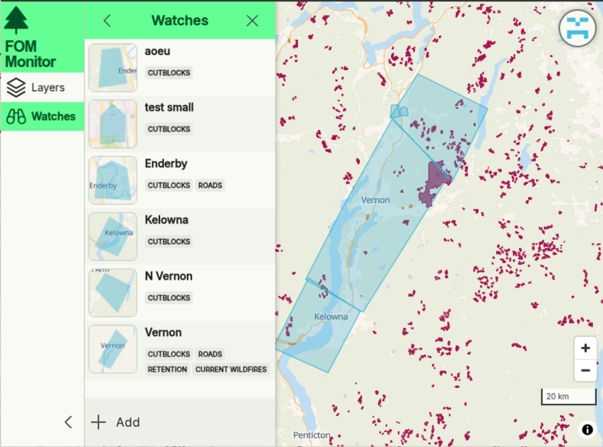

# FomMon - A GIS monitoring web app for BC Canada

This project is in early development. It's a personal project to learn c# + angular web app dev. 

## Features
 - Watch specified areas for changes
 - Select from a variety of data sources:
   - Planned logging cutblocks (Forest Operations Map)
   - Current and historical wildfires
   - (more to come; BC Geographic Warehouse layers trivial to add)

## Roadmap
 - Self-hosted OSM for topo tiles & monitoring features
 - Activity feed view
 - Email notifications
 - Quick-add watches with sane presets
 - Filtering criteria for watches
 - Deploy demo
 - RProxy + caching
 - Landing page

## Built With
 - Backend:
   - ASP.NET CORE
     - .NET Aspire orchestration
     - Entity Framework Core
     - Hangfire background jobs
   - PostgreSQL database + PostGIS
   - MapLibre Martin Tileserver
   - Keycloak authentication
   - MinIO object storage
   - Redis caching & hangfire persistence
 - Frontend:
   - Angular 20
   - MapLibre

## License
Distributed under the GNU GPLv3.  See LICENSE.txt for more information.

### Third-Party Software
This project uses osm2pgsql-themepark (Apache 2.0 License)
https://github.com/osm2pgsql-dev/osm2pgsql-themepark